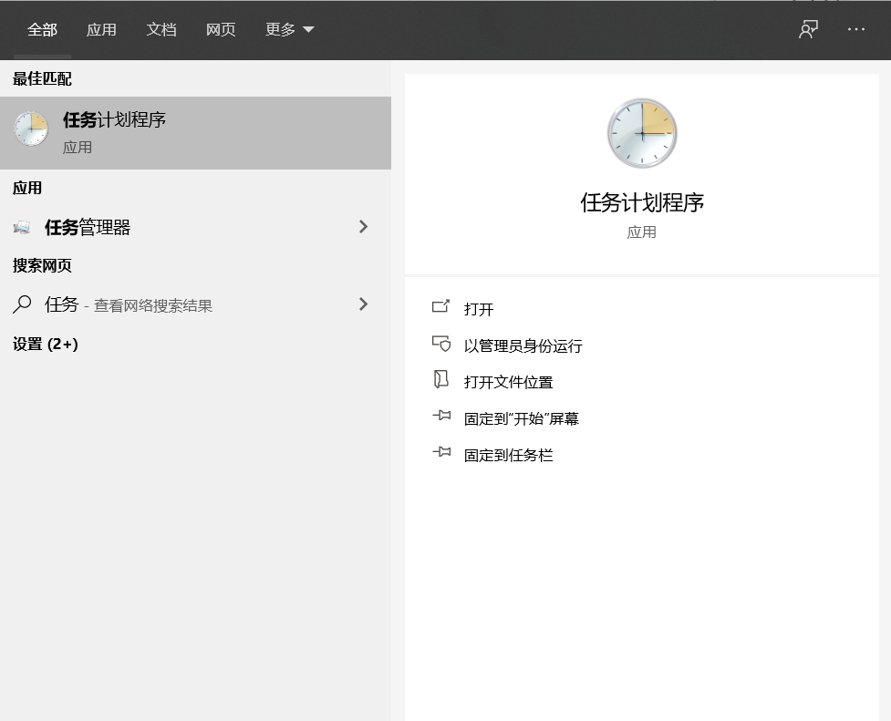
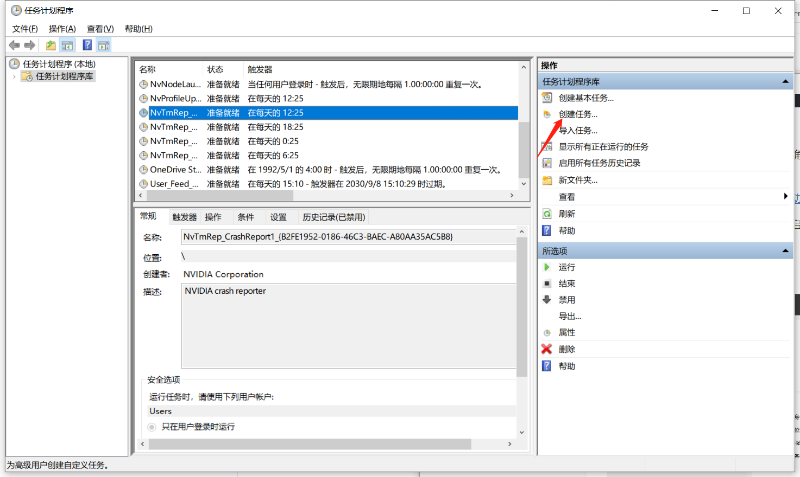
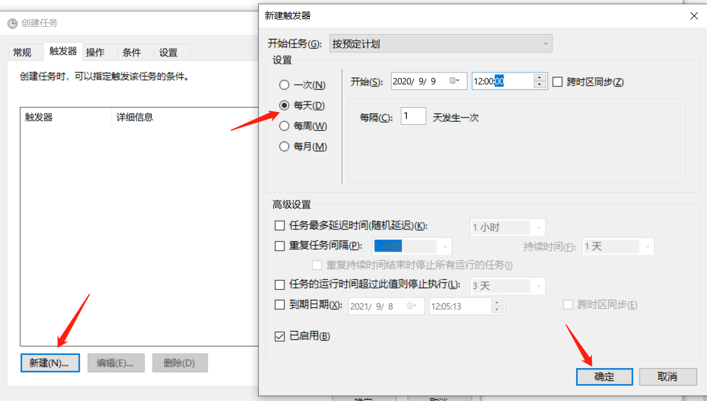
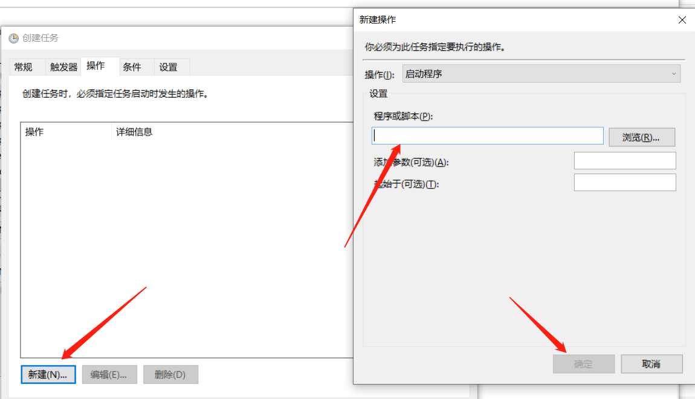

### 自动上报

**晨午体温填报版本**

> 使用方法：

1. 点击本页面的 Code，下载ZIP 

2. 解压并打开 **自动填写.exe** 文件（请勿删除其他文件）

>  注意事项

**连接学校WIFI时无法进入网站，会导致程序报错**

第一次使用需按照提示输入用户信息，

若提示找不到驱动或出现奇怪的报错，确保你使用的是最新的谷歌浏览器(85版本)

使用其他版本的，请按提示下载[对应驱动](http://chromedriver.storage.googleapis.com/index.html)

然后替换`chromedriver.exe`，并重新启动程序

> Windows 用户定时任务

搜索栏搜索

创建任务 *可以在常规当中更改任务名字*

因为第一次运行会生成一个实例，用于记录账户密码，所以建议触发时间可以先选一个比较接近的，运行完第一次后再将时间改回来

选择 **自动填写.exe**

点击确认完成定时任务。

然后就可以每天定时自动上报了

***

> 如果本项目对你有帮助，请我喝杯奶茶

